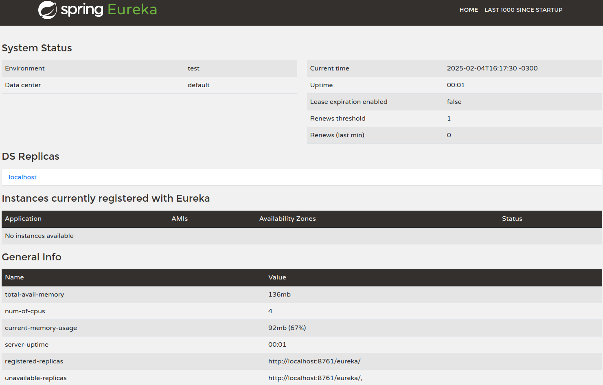

#  Project lab-a01-infra-service-registry

Esse projeto é um pequeno exemplo do uso da infra Eureka Server destinado a quem quer estudar sobre o assunto.


## 🚀 About Me
Projeto de estudo da funcionalidade do Spring Cloud Eureka Server


## Rode Localmente

Clone o projeto

```bash
  git clone https://github.com/williamreges/lab-a01-infra-service-registry.git
```

Entre no Projeto

```bash
  cd my-project
```

Instale as dependencies

```bash
  mvn clean install
```

Start o serviço

```bash
  spring-boot:run
```
Entre no link
http://localhost:8761/

Será mostrado o serviço rodando via browser conforme exemplo abaixo:




## 🔗 Referencias
* [Spring Cloud](https://spring.io/cloud)
* [Service Registration and Discovery](https://spring.io/guides/gs/service-registration-and-discovery)